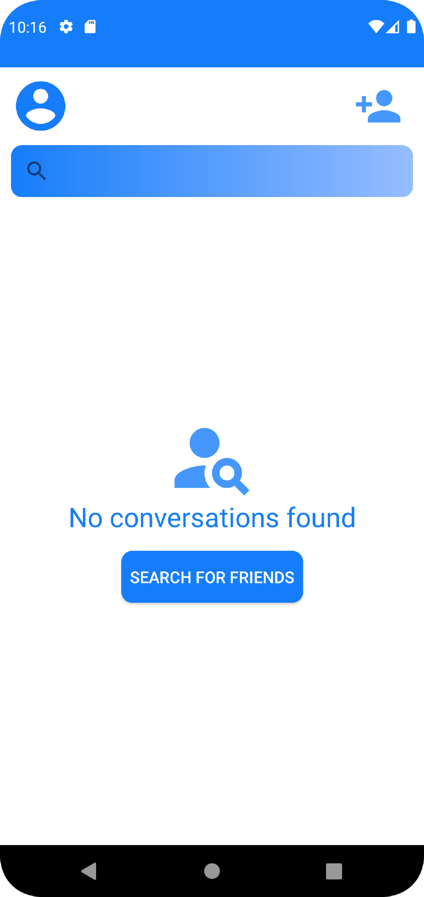

# Messenger
---
## About this project
A front-end mobile part of my full-stack messaging app

## Tech used:
### Mobile
- Java
- RxJava, RoomDatabase
### Backend
- Python
- Flask
- Connexion
- PostgreSQL
---
## Features

### :pushpin: Full login system

### :mag: Search for friends

### :email: Chat with them real-time

### :moon: Dark and light mode

